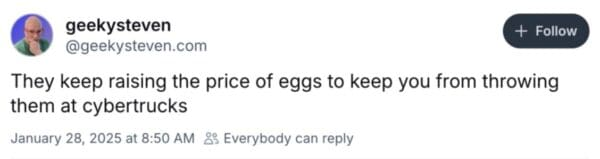

Let’s, for a moment, press mute on the current global shitstorm and focus closer to home. Let’s talk about you. Or, really, me. But I have a feeling you’ll be nodding along at a thing or two.

How are you holding up? I’m not doing too awesome. I caught myself Googling, “[What do you do when you feel helpless?](https://www.google.com/search?q=what+do+you+do+when+you+feel+helpless&ie=UTF-8&oe=UTF-8&hl=en-us&client=safari)” in a spare moment before my kids’ band concert. And after the concert, I found myself uncontrollably yelling, “FUCK YOU!” at a Cybertruck driving through the high school parking lot.

I’m gutted, overwhelmed, scared, and just plain burnt out. I’ve been mentally rummaging through every helpful tool my therapist has ever given me, and I’ve realized—this is trauma. _I_ am experiencing trauma. _We_ are experiencing trauma. I’m not just talking about the national angst that comes from hearing the creaks and groans of our government’s pillars—I mean our collective mental well-being.

Every decent person, regardless of political affiliation, who isn’t on board with this **Whyte Thug Life** (let’s make that a thing somehow, OK?) is experiencing trauma. A lot of us are lucky because we (especially white men) have the privilege of just being anxious and skittish. But the wave of layoffs that keeps surging? That’s a whole different level of trauma. Add in the stress of job hunting in a brutal market, knowing the economy is swirling into a cesspool, and it’s no wonder my empathy is amplifying my own anxiety. But it’s more than that.

That anxiety is warranted, and their hatred of all things non-white Jesusland is laid bare. Most of us don’t feel great right now.

_They're coming to get you, Barbara._

At this point, I don’t think it’s too conspiracy-theorist to say, “And they’re coming for YOUUU.” Because, in some form or fashion, they are. They're hitting all the top things they hate right now, but you might be next. Maybe you’re far down the line, but at some point, some dickwit, Whyte Thug Life stunt meant to “pwn the libs” is going to have a real-world effect on us reasonable humans—if it hasn’t already. It’ll start small, like this price-of-eggs bullshit. You know… memeable stuff. But something truly painful is lurking in the shadows, waiting. And the country _asked_ for this to happen—for reasons I still can’t comprehend.

Housing. Materials. Food. The list of essentials is vast and may soon be out of reach. And not in a “ration your cheese for the troops” (oh dear God, let’s hope not) kind of way, but in a “ration your cheese because the cabal of masculinity-cosplaying thugs in Washington went full Wile E. Coyote and blew up the country’s infrastructure, and now dairy cows are being culled because it's not OK that they’re simultaneously black _and_ white” kind of way. _Something_ you take for granted today may soon be a memory. I hope it’s not something essential to your health or safety.

I’m all mad now, and that’s the thing—I’m too overwhelmed to do anything productive or useful with that energy. Other than, you know, reflexively yelling “FUCK YOU!” at a Cybertruck.

On [Bluesky](https://bsky.app/profile/jeremyfuksa.com), I see post after post filled with understandable anger and fear—the kind that feels slick, like a cold sweat. And I love that most of the people writing them are turning that energy into action in all kinds of ways. But then I feel bad when I realize…I just can’t seem to do that myself. Though, maybe I’m off to a decent start here. At least I’ve got the anger, fear, and cold sweat part down. It’s the action part I’m struggling with.

Right now, I’m under a weighted blanket of bad vibes that’s keeping me from putting my energy or talents toward _something_ that might actually help. Even if it’s just some dumbass video that makes one person smile in an otherwise miserable day.

I don’t know how to get myself to a place where I can contribute something meaningful to this completely unhinged zeitgeist. But writing all this has helped. So I’m going to start writing and posting most days. Let’s be realistic, though—I won’t be consistent. My output will definitely be hot and cold. And it’ll probably feel a lot like listening to someone talk out loud to work through a problem.

But I know you. You like that kind of stuff. Stick around.

Besides, it’s your turn. How are _you_?
