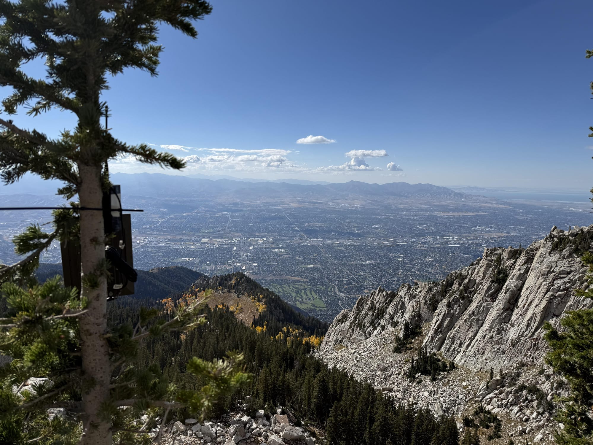

I've spent the last few weeks building an open source communications network I can't explain. Not because it's classified or complicated. I just can't tell you why I'm building it. Not to my family. Not to my friends. Not even to myself, really.

I can describe what it does: it's a [Meshtastic network](https://meshtastic.org/) using [LoRa radio technology](https://meshtastic.org/docs/introduction/) that lets small devices communicate with each other without cell service or internet. Messages hop from node to node, creating a self-healing network that works off-grid. My node runs on a [Heltec V3](https://heltec.org/project/wifi-lora-32-v3/) that fits in my hand. A [LoRa hat for my Raspberry Pi](https://www.waveshare.com/sx1262-lorawan-hat.htm) is coming in the mail from China to run a 24/7 router node. No tariffs on that yet.

But if you ask me why any of that matters, I've got nothing. It's a bunch of tiny boxes talking to other tiny boxes. It's cheap enough that you never hit that moment where you have to justify spending $200 on anything. You just keep ordering more tiny boxes.

## The Thing Nobody Talks About

I sent out a test message on the Meshtastic primary channel. Got a response from someone nearby. The silence since then tells me one message was enough.

This is what nobody mentions when they talk about Meshtastic: most local meshes are quiet. Not broken. Quiet. The infrastructure works. The technology is sound. There's just nothing happening on it day-to-day because nobody has a practical reason to send messages.

Turns out I'm not pioneering anything. There's already a [Kansas City mesh](https://kansascitymesh.org/) with 68+ nodes and organized community infrastructure. I just discovered it after building my first node. The silence on the public channel isn't because nobody's building. It's because even in an active, organized mesh with real community coordination, most communication happens privately or people just run infrastructure without constant chatter. The network exists. The daily usage question remains.

The boilerplate philosophy is that Meshtastic is for when everything else breaks. When cell towers go down. When the internet fails. When infrastructure collapses and we're all trading bottle caps for gasoline. Emergency preparedness. Off-grid resilience. Decentralized networks.

But day-to-day? Cell phones work. Text messages are reliable. Need to keep track of a kid? Get an app. It's guaranteed to be 100x better.

Some people do use Meshtastic to text with family or track kids' locations right now. Maybe they're in rural areas with spotty cell service, or they want communication that doesn't depend on cellular infrastructure. For them, it solves a real problem.

But for me? I can't find the practical use case. I'm not building this because I genuinely believe everything is about to collapse (but let's not be hasty). I'm building it because I see photos on Reddit of solar-powered nodes installed on mountaintops and I think they're awesome. I want to do the same thing. Maybe on a tall office rooftop, a self-sustaining unit the size of a box of baby shoes mounted in a weatherproof enclosure with a solar panel.

_A Meshtastic solar node in Salt Lake City - Photo: u/stuffandthingz7_

Then I imagine actually having that conversation with a building owner:

> "I want to mount a baby shoe box on your roof so it can talk to another baby shoe box in Olathe. Maybe Smithville.  
>   
> For when everything breaks. No, not for your building specifically. Just in general.  
>   
> Yes, I know cell phones exist."

## I Thought Ham Radio Would Help Me Understand

Coming from [ham radio](https://www.arrl.org/getting-licensed), I thought I'd have a framework for understanding the radio communications side of Meshtastic. I keep catching myself applying mental models that don't translate. Thinking more power means better range (it doesn't work that way here), expecting some sort of participation (these nodes just do things autonomously, and I'm just watching infrastructure participate without me).

But here's what I'm realizing: I can't use ham radio to explain Meshtastic because I can't explain ham radio either.

In 2025, try explaining to someone why you own a radio that lets you talk to people you don't know about nothing in particular. Try justifying the license, the equipment, the antennas. It's all pain in the ass gear that's useful "just in case." And "just in case" isn't a reason. It's a placeholder for "I don't actually know."

The shift from ham radio to Meshtastic isn't about learning new technology. It's about realizing both hobbies are equally absurd when you try to explain them to someone who doesn't already get it. At least with ham radio, the price point eventually forces you to stop and think. With Meshtastic, you can accumulate a whole network of baby shoe boxes before you ever ask yourself why. You start thinking about nodes at your office, your parents' house, that coffee shop you go to on Saturdays.

## The Honest Answer

Here's what I think is actually happening: I enjoy building infrastructure. The network optimization is interesting. Figuring out antenna placement and hop counts and topology is satisfying in the way that solving any technical puzzle is satisfying.

The theoretical emergency use case is, to me, a nice to have. The one practical application I've found (automated weather alerts pushed to the mesh) gives me something concrete to try to achieve.

And maybe that's fine. Maybe infrastructure building as hobby is enough of a reason. Maybe the Wee Keds boxes don't need to justify their existence beyond "I wanted to see if I could make them talk to each other." Maybe the low barrier to entry (the fact that you can start building for under $50) is a feature, not a bug.

Though, technically, you could stop at under $50. You just don't have an easy way to verify if your node works when you only have one. So you buy a second one. And once you have two working nodes talking to each other, well, now you're thinking about what a third one could do. You start calculating which friend's house would make the best relay point. You begin mentally rehearsing conversations: "Hey, would you mind if I zip-tied a small weatherproof box to your fence? It's for radio stuff. No, you won't notice it. Probably."

## For You?

If you're reading this and thinking "should I try Meshtastic," here's my honest assessment:

**You probably shouldn't** if you're looking for a practical communication tool. Your phone does this better. A $12 walkie-talkie from a gas station does this better.

**You might want to** if you're in a group with actual coordination needs in areas without cell coverage. Or if you're practicing emergency communication with a commitment to regular check-ins and drills. Or if you enjoy building infrastructure that doesn't need to justify its existence. Or if you want to do a possibly pointless but potentially limitless thing with me and whoever else is out here ordering tiny boxes.

The question isn't "is Meshtastic useful" but "are you someone who enjoys building infrastructure for its own sake?" At $30-40 per node, it's cheap enough to find out.

I [asked the Meshtastic community](https://www.reddit.com/r/meshtastic/comments/1nujsd2/i_still_cant_figure_out_why_were_doing_this/) what they're actually doing with their meshes day-to-day. The responses confirmed what I suspected: most people are infrastructure hobbyists. "Because we can," one person said. "I'm a nerd," said another. "New map pings make me smile." Some found legitimate use cases (music festivals, rural coordination, actual disaster preparation). A few built social communities using the tech as an organizing principle. The [Buffalo, NY mesh](https://buffalora.org) has 270 nodes and regular meetups. The Kansas City mesh I accidentally joined has 68+ nodes and organized community coordination.

But even in these established meshes, the fundamental question remains: what happens on a Tuesday? The infrastructure is impressive. The community coordination is real. The daily usage is still mostly theoretical or private.

I'm still building my mesh. Still fighting the urge to buy more hardware. Still planning that rooftop baby shoe box with the solar panel. Still mentally cataloging every tall building and willing friend.

I've spent less than $100 on this and still can't explain why.

* * *

I noticed in my article, [Well, Hell](/writing/well-hell/) back in April, I told you I was headed straight into the operating room and that did not happen. At all.

Soon after the post, I had a cardiac catheter as a prep for the surgery, and it turned out things were a lot better than they surmised from the CT imaging. I had my six-month follow up yesterday, and with any luck this is the last I'll say anything about it.
