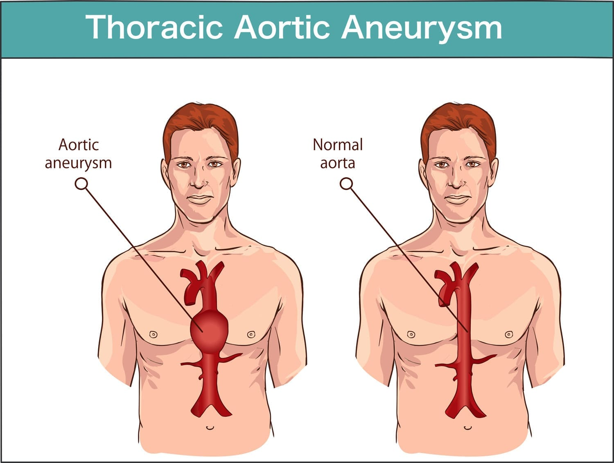

For those of you who aren’t following me on Facebook or Instagram, you should know that I had a stroke last September. It was a transient ischemic attack (TIA)—a formal way of saying “mini-stroke.”

If you’re interested in what happened, here are some links to Instagram videos:

-   [Part 1](https://www.instagram.com/reel/C_d5hYypRbc/)
-   [Part 2](https://www.instagram.com/reel/C_eA8cTJqfu/)
-   [Part 3](https://www.instagram.com/reel/C_hSd71JN0C/)
-   [Part 4](https://www.instagram.com/reel/DAJ6rYPJORk/)

Since Part 4 was recorded six months ago, those who already knew might have wondered how I’m doing—especially since I pretty much disappeared from public life afterward, or at least the public life I was involved in at the time. I’m happy to report that things aren’t too shabby.

## Can't Complain

If you watched the videos, you know I ended the series by talking about some lingering effects from the stroke. These days:

-   I’m no longer as sensitive to light.
-   The weird doubling shape in my left eye has disappeared.
-   Any unsteadiness I had is gone.
-   I don’t get nearly as tired as I used to every day.

Basically, whatever was going to happen from that stroke has already happened.

But during my hospital stay, they found something else—an aortic aneurysm. It was too small to worry about… yet. Fortunately, I still had a cardiologist from my arterial bypass 20 years ago, so I got in quickly. He sent me to the cardiac surgeons, who determined that the aneurysm was still too small to justify the risks of cracking my chest open a second time.

I have a **CAT scan in March** to check for growth. If it’s negligible, we’ll check again in October. If it’s concerning, I’ll be getting an aortic replacement—along with a bypass refresh while we’re at it. Familial hypercholesterolemia is a **real** pain.

In the meantime, I’m stuck in a weird dilemma. I’m afraid to overexert myself or even, uh, strain too hard in the bathroom, all in the name of preventing aneurysm growth (or worse). But exercise helps me, and too little—or the wrong kind—could be just as bad. So, I try to keep it out of my mind while I wait for March.

## Still...

I do have a few lingering neurological quirks:

-   My short-term memory wasn’t great before. It’s worse now. Having a grandma who developed serious dementia doesn’t exactly put me at ease.
-   Words escape me more often, but I’m not sure if that’s the stroke or just aging.
-   I’ve developed an almost **debilitating** sensitivity to loud, high-pitched sounds.

That’s a whole other post, but let’s just say I’ve actively worked on fixing it. Again, I’m not sure if it’s the stroke or age, but I’m leaning toward stroke.

And that’s it. I’m here. I’m forgetful. I hate squeaky shoes. I’ll let you know how things go in March.
