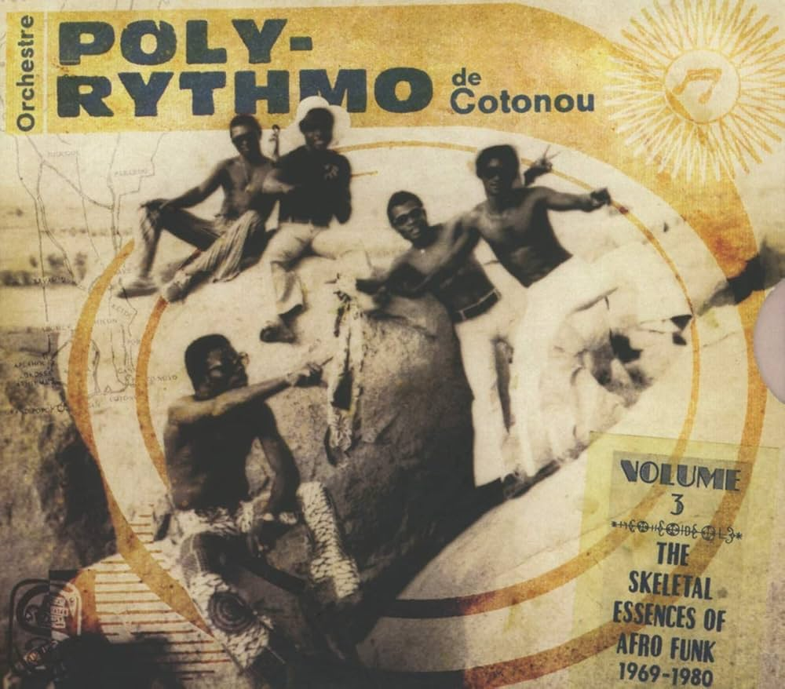
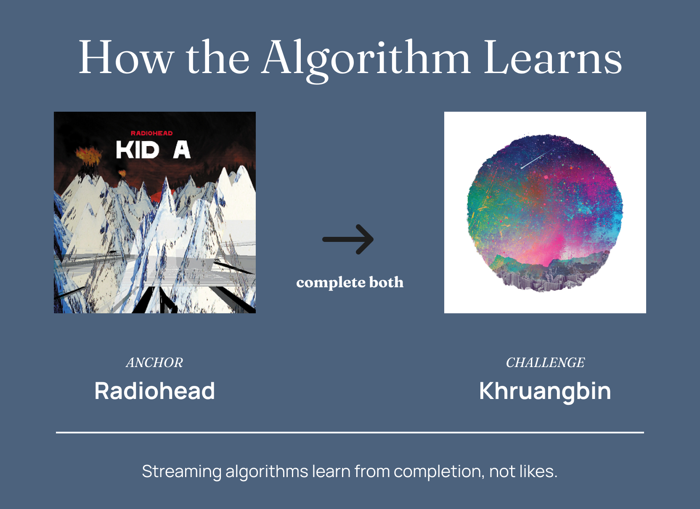
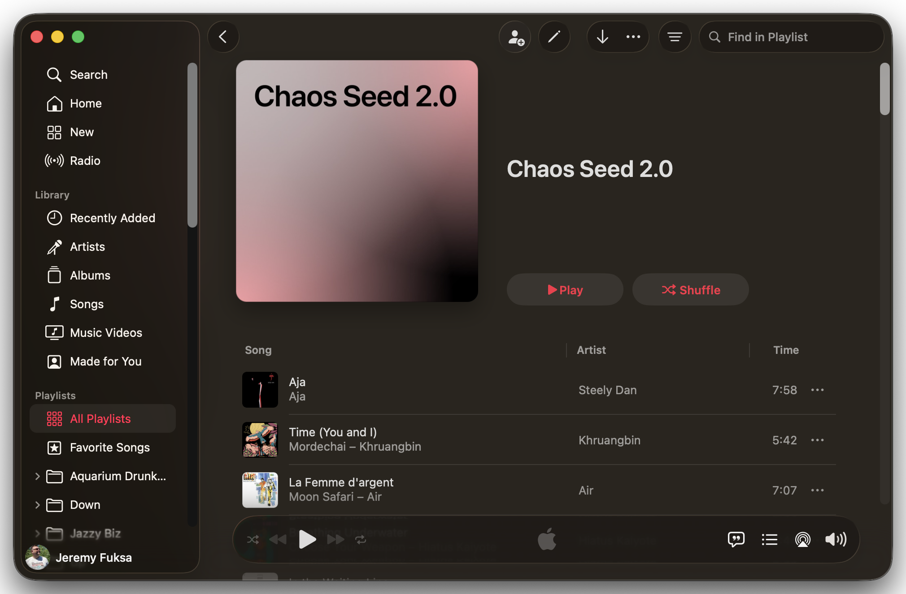

I used to find bootleg MP3 compilations of thrift store vinyl online.

Private press soul. Unreleased West African funk. Weird exotica from labels that pressed 500 copies and disappeared. Someone would dig through estate sales and dusty record bins, rip the vinyl, compile the best tracks, and drop a zip file on a blog somewhere. I'd download it and discover entire worlds.

That's how I heard stuff I'd never search for because I didn't know it existed. Then streaming became the easy way to find music, and I stopped looking.

But the music didn't disappear. Some of it had to be sitting in Apple Music's database, catalogued and available. The algorithm just had no reason to surface it. I kept finishing Radiohead tracks, so it kept serving me more Radiohead-adjacent sounds. Why would it show me Orchestre Poly-Rythmo?

Streaming algorithms trap you. Doesn't matter which platform. Spotify, Apple Music, YouTube Music — once they think they know you, they stop exploring. The algorithm optimizes for engagement, not discovery. The longer you listen, the narrower it gets.

For years, every time I opened my personalized station, I got served another track that sounded exactly like the last one I'd finished. I knew there was music I'd love in the database that wouldn't surface on its own — West African guitar, Brazilian music, artists from other countries who'd been influenced by the music I grew up with.

So I tried using AI to break free of my algorithm. To start finding music that touches the fringes of my listening habits.

Two and a half months later, my personalized station started surfacing music I'd never heard it suggest before. West African desert blues. Brazilian music. Artists from other countries working in styles I already loved. The kind of stuff I used to find in those bootleg compilations — but now the algorithm was doing the excavation work.

## Stretching the Edges of my Algorithm

I exported my listening history. 4,631 tracks.

I'd discovered an app called [PlayTally](https://apps.apple.com/us/app/playtally-apple-music-stats/id1513271356) last fall. It tracks Apple Music listening across all your devices and exports it as tab-separated values files. I let it run for a few months, then analyzed the data with Claude.

68% Rock/Alternative. 0.2% from outside US/UK/Canada. Dominated by 90s alt-rock and 2000s indie. And loop behavior: Elton John's "Tiny Dancer" had played 702 times.

So I set to widening the musical horizons to what I really wanted. But when I described what I actually wanted, it wasn't genres. It was textures.

"Fender Rhodes dripping with chorus."  
"Pedal steel in music that isn't country."  
"Quiet jazz. Not the freeform stuff."

The algorithm couldn't be taught in those terms. Genre tags cluster artists into huge buckets — "Alternative," "Rock," "Jazz" — but inside those buckets are tiny micro-genres that drown. I knew they were in there. I just needed a way to surface them from a system that wasn't built to understand texture.

## How Streaming Platforms Learn

Algorithms don't learn from likes. They learn from completion.

The heart button? Weak signal. People tap it reflexively.

Finishing a track? Strong signal. You didn't skip. It held your attention.

Sequential completion is stronger. Track A, then track B, in order. The algorithm infers a relationship. _When this user completes these two back-to-back, there's a pattern._

Claude built playlists using anchor/challenge pairs. Example:

-   Radiohead — "Pyramid Song" (familiar)
-   Khruangbin — "María También" (unfamiliar, but shares the Rhodes texture, the reverb, the slow build)

Method: complete them sequentially. Radiohead finishes, Khruangbin starts. Repeat. The algorithm learns: _This user completes Radiohead, then completes Khruangbin. Pattern._

The playlists had four movements: texture expansion, geographic expansion, catalog depth, Britpop. 79 tracks. I kept the track count fairly low so that I could get through the playlist a few times during the two weeks I ran them.

## Morphing Musical Footprint

Two and a half months later, seven artists appeared from the depths and into my rotation:

Blur — 4 plays  
Pulp — 3 plays  
Tinariwen — 1 play  
Gilberto Gil — 1 play  
Chet Baker — 1 play  
Gillian Welch — 1 play  
Yo La Tengo — 1 play

Not searched. Surfaced by the algorithm. 55% of the challenge artists I'd seeded showed up independently in my listening within two and a half months. Rock/Alternative dropped from 68% to 57%. Jazz went from 4.5% to 6.2%. Electronic doubled.

The algorithm is stretching its taste footprint.

## Some Seeds Don't Grow

Japanese city pop flopped. I seeded Tatsuro Yamashita, Mariya Takeuchi, Casiopea. Zero uptake.

Nordic jazz failed. Nils Frahm, Ólafur Arnalds — nothing.

West African barely took. Only Tinariwen stuck out of four.

I don't know why. Maybe the algorithm resists certain genres even with deliberate training. Maybe user engagement patterns from other listeners. Maybe licensing complexity. Maybe pure stubbornness.

## The Stretching Method

Want to try to do a little bit of algorithm stretching of your own? Then there are three things you need to consider.

### **Data forensics**

What are you actually listening to? Export your history. Look for concentration, loops, temporal freeze, geographic blindness.

For Apple Music, use [PlayTall](https://apps.apple.com/us/app/playtally-apple-music-stats/id1513271356)y to track listening across devices and export as TSV files. Spotify has built-in export at privacy settings — request "Extended streaming history" (not just account data) and wait up to 30 days for the download. Most other platforms have some way to get your data out.

### **Training architecture**

Anchor/challenge pairs. Anchor = track you love. Challenge = adjacent unknown. Key word: adjacent. Don't jump from Radiohead to death metal. The algorithm won't follow. Small steps. Play the playlist sequentially. Repeat and hope you don't get sick of the music in the process.

#### From AI to playable playlist

I used Claude Cowork with computer control and AppleScript skills. Cowork wrote AppleScript that talked directly to the Apple Music app — created the playlist, searched for each track, added them in order, saved it. The whole thing showed up in my library a few minutes later, ready to play.

If I'd had to manually add every track, I'd have given up after twenty.

### **Iteration**

Your first attempt will probably fail. Mine did. If the challenges don't match your taste, rebuild. Don't trust genre tags. Use sound characteristics. Textures, instruments, tempo, mood.

I even tried one version of this experiment where, instead of textures, I gave the model a vivid illustration of a place I used to go and had it infer music based off of the story. Talk about an interesting playlist.

## ... And You Can Boogie, Too

The algorithm learns from behavior. Change what you complete and in what order, and it adapts — and this works on any platform, because Spotify, Apple Music, and YouTube Music all weight completion behavior the same way. The interfaces differ; the mechanics are the same.

Most people try to fix their algorithm by liking random diverse tracks, which is a weak signal that the system mostly ignores. Deliberate sequential completion over time is a strong one. It takes effort — two and a half months in my case — but my algorithm started surfacing West African desert blues and Brazilian music it had never suggested before, and that was just from one round of training.

I'm curious what happens next. What if I broke up the existing anchor/challenge pairs and re-shuffled them with other tracks in the playlist? New adjacencies, same source material, different patterns to learn. Could surface different stuff entirely. Worth trying.

* * *

**P.S.** Full methodology — playlists, data, iteration — documented if you want it. Email me: hello@jeremyfuksa.com

If you're curious, these are the original seeds that I made:

-   [Chaos Seed 2.0](https://music.apple.com/us/playlist/chaos-seed-2-0/pl.u-YBWqurv3Rx)
-   [Instrumental Deep Dive](https://music.apple.com/us/playlist/instrumental-deep-dive/pl.u-b5x4TJakML)
-   [Decade Backfill](https://music.apple.com/us/playlist/decade-backfill/pl.u-AY43I8vE57)
-   [Genre Walled Garden](https://music.apple.com/us/playlist/genre-walled-garden/pl.u-vdp4tKrkb1)
