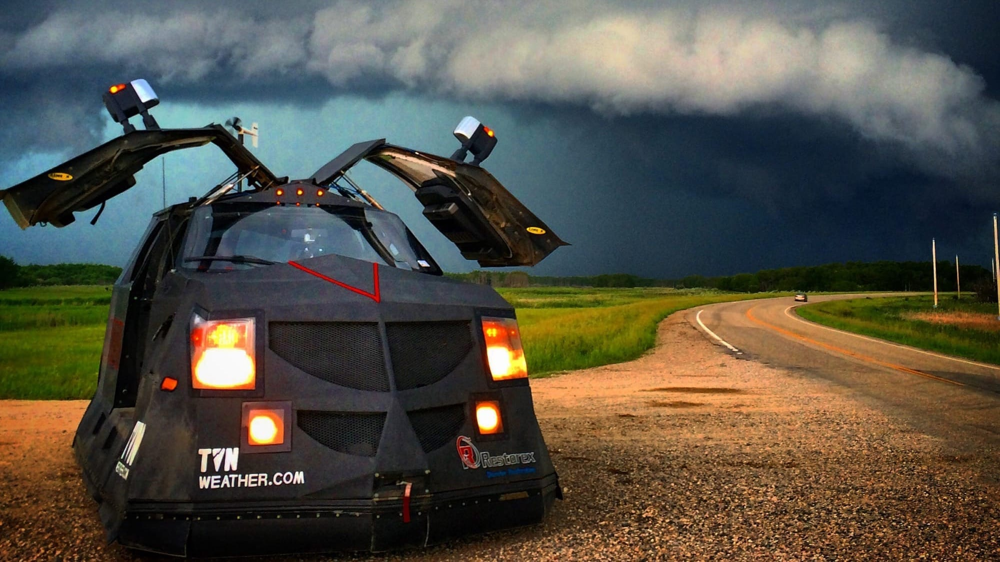

Storms rolled through Kansas City tonight. My scanner picked up the local emergency weather nets and filled my office with storm spotters — reports of wind speeds and hail size from different corners of the city, cutting through static. I was supposed to be working on a project, but instead found myself eavesdropping on strangers talking about wind speeds and hail size.

I've always found ham radio check-ins painfully dorky. Every week, amateur radio operators gather on specific frequencies just to confirm they exist — call signs exchanged with practiced formality, quick reports on how well their signal is coming through, minimal pleasantries. From the outside, it all seems unnecessarily structured, a radio ritual without obvious purpose. Like people gathering to read the phonebook to each other once a week.

Until it matters.

The person running these sessions doesn't need more than a quick mention of your radio name to know who's speaking. Those seemingly pointless weekly check-ins teach them where people are from, what equipment they're using, how someone's voice sounds when they're calling from a car. What looks like just playing radio from the outside is actually preparation for moments like this, when important information needs to travel quickly and clearly through stormy conditions.

When an emergency weather net activates and storm spotters are zooming around the city giving reports, that practiced way of talking becomes efficient. The formality becomes clarity. The dorky transforms into necessary.

To be fair, some folks are totally LARPing as first responders on these frequencies. You can hear it in how they stretch out transmissions, adding unnecessary details, savoring their moment of performed importance. I came across a [Reddit thread](https://www.reddit.com/r/amateurradio/comments/1il5s7l/amateur_radio_emergency_preparedness_act/) earlier today that had me nodding along with the criticisms until I realized I was doing it while literally listening to these same people on my scanner. There's probably a German word for that specific flavor of self-deception.

I grew up in rural Oklahoma where tornado sirens were the soundtrack of spring. I used to get physically sick when those Emergency Broadcast System tones interrupted regular programming, drilling into my nervous system like a dentist hitting a nerve. My body would clench up while my mind raced with terrible possibilities. Our underground cellar stunk of mildew, and you never knew if snakes had decided to take shelter with you.

And yet I dreamed of being a storm spotter. I imagined driving our country roads with a radio mounted under the dash, watching wall clouds rotate, reporting with calm precision on conditions that terrified me. Fear and fascination tuned to the same frequency.

_I got to sit in a car similar to this in the early 2000s. That was a good day._

I've always been drawn to the seedier side of radio — CB channels late at night, pirate stations broadcasting from makeshift studios, drunk rants floating through the atmosphere when skip conditions are just right. These transmissions feel authentic — unpolished signals carrying raw humanity.

But now I'm looking into the certification necessary to join Skywarn, wondering what it would really be like to participate. These guys approach weather with a seriousness that's easy to mock from a distance - the practiced terminology, the official vests, the whole system of it. But when you listen long enough, you start to see the purpose behind the formality. I've spent years in Scouting with my own ceremonies, uniforms, and specialized language. Turns out I'm not allergic to dorkiness after all - I just prefer my flavor of it to come with merit badges and knots instead of callsigns and radio protocols. At least until now.

And I'm listening to them. Regularly. I've programmed their frequencies into my scanner. I can recognize some of the regular operators by voice now, though they don't know me — I'm just receiving, not transmitting. Not yet.

There's a threshold here I haven't crossed. Something shifting from observation to curiosity. I might as well come into the circle and see what everything's all about. Check into a net with my own callsign. At some point, you either admit you're interested or you keep pretending you're just doing research for a project that doesn't exist.

It might be everything I imagined as a kid, looking up at Oklahoma skies turned green, wondering who was out there tracking the storms that both terrified and fascinated me.

Radio creates a weird intimacy. These voices emerging from static connect through the air itself. There's something almost magical about hearing someone's voice traveling across space without infrastructure, without companies, without subscriptions — just atmosphere and physics bringing strangers together.

The storms are passing now, scanner traffic slowing to routine check-ins. But something has shifted in me, a signal finally received after years of atmospheric bounce. I realized tonight I can't really make fun of them when I'm clearly in just as deep. I just didn't know I was wading in.

I've been practicing how to say my callsign in the car.

It's only a matter of time before I start explaining propagation conditions to people who didn't ask.
