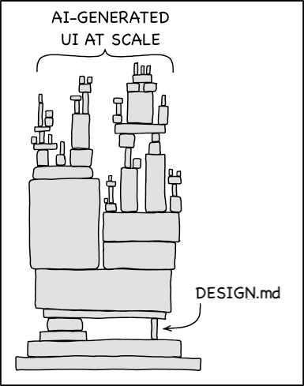

Google [Stitch](https://stitch.withgoogle.com/) introduced the DESIGN.md format earlier this year, and [Claude Design](https://claude.ai/design)'s launch in April pushed it the rest of the way. One markdown file describing your design system, readable by any AI tool, dropped into the prompt as truth.

The format is now everywhere. There's a [GitHub repo](https://github.com/VoltAgent/awesome-claude-design) collecting 68 of them, scraped from top global brands. The pitch on the README is "Drop one in, scaffold a full UI in one shot." Point Claude at the file, get the brand.

The scraped files don't carry the rationale, though. You might be able to fix this by writing the why into the file and the model will respect the constraint. That's half right, and writing rationale into this file is better than nothing. But it's far from the right thing to do.

## Spec is the wrong word

A DESIGN.md file is a **specification**. It tells the tool what to make. Colors, spacing, type scale, components, the rules that bound them. Even when you write rationale into it, the rationale stays scoped to the spec. The spec enumerates what was decided and why, for the cases that got enumerated.

**Intent** is the surrounding condition that makes the specification mean something. Who the user is, what they're doing when they hit this screen, what the business is trying to accomplish, what tradeoff got rejected and why, what the system is responding to.

## Three missing layers

The actual shape of intent is layered. There's a base layer the model already carries from training: accessibility standards, common GUI conventions, the stuff every interface roughly agrees on. There's a domain layer that overrides the base with whatever your company knows that the LLM gets confidently wrong, whether that's e-commerce conversion patterns, financial compliance, healthcare clinical reasoning, or the specific way your customers think about their own work. There's a component layer where the design system actually lives: tokens, rationale, when this pattern is dangerous to deviate from. And there's a role layer for who's using this interface, in what conditions, with what stakes. DESIGN.md operates on one of those three additional layers. The other two sit mostly unwritten, mostly in people's heads.

_Diagram remixed from xkcd #2347, "Dependency", used under CC BY-NC 2.5. The image has DESIGN.md doing the structural work alone. Adding three more pillars would help a lot._

The gap between scraped tokens and a system that feels intentional is a hot design topic, and most working designers can name the failure mode the moment they see it. DESIGN.md is the easiest part of the total solution. Building the other layers requires people who know how to build them. And it requires that you get experienced people to sit down and bare their brains to your system (another hot topic for another time).

## Four things intent has to become

Intent in AI design has to become four things it currently isn't.

**Stable**, meaning it doesn't drift between sessions, between models, between tool calls inside the same session. Hand Claude a DESIGN.md, generate ten screens, you get ten interpretations of the same constraint. The intent layer has to hold its shape under repeated retrieval.

**Consistent**, meaning two designers, or a designer and an engineer, or two AI agents working on the same system arrive at the same answer to the same question. The intent has to be findable as a single source. "What's the rule for destructive actions" should resolve to the same answer regardless of who's asking.

**Accurate**, meaning the rationale actually matches the constraint. "Reserved exclusively for purchase-path actions" feels like you've captured the rule, but you've captured one designer's articulation of it on one Tuesday afternoon. Accuracy requires the rationale to be tied to its source, the research or business or strategic decision that produced it, with a path back to verification. Otherwise it's vibes encoded as prose.

**Possible**, meaning enough of the rationale gets coded for the model to actually have something to work with. Current tools can read intent fine. The problem is that nobody is encoding intent at a scale where it changes the output. A handful of rules in a markdown file is not an intentional design system. A design system is thousands of decisions, most of them undocumented even on the human side, and the intent layer has to capture enough of those decisions to actually shape what the model produces. Possible means somebody did that work, and almost nobody has. That's because it's super hard on so many levels.

## What I've been building

I've been working on a structured version of this for a while, and even at a personal scale, it's hard to get the intent layers dialed in. The idea is that a design system stops being a library you consult and starts being a brain you trust, and there's a lot of work that has to happen between solid and trusted.

The gap isn't between "DESIGN.md with rationale" and "DESIGN.md without rationale." The gap is between specification and executable knowledge: a design system that doesn't just describe itself but answers questions, holds constraints under pressure, and tells you when a request would violate them. Not many of those exist yet. DESIGN.md is what we have for now.
